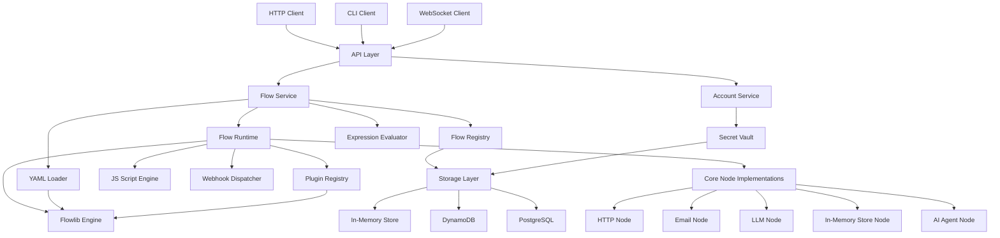

# Design Document

## Overview

Flowrunner is a lightweight, YAML-driven orchestration service built on top of Flowlib. It provides a RESTful HTTP API for managing and executing workflows defined in YAML, along with multi-tenant account support, secrets management, plugin extensibility, inline JavaScript scripting, and webhook capabilities.

The system is designed to be modular, with clear separation of concerns between components. It leverages Flowlib's core workflow engine while adding higher-level abstractions for YAML parsing, HTTP API endpoints, authentication, secrets management, plugin loading, JavaScript execution, and webhook handling.

Key features include:
- YAML-based workflow definitions with expression support
- Multiple persistence options (in-memory, DynamoDB, PostgreSQL)
- CLI and HTTP API interfaces for flow management and execution
- Core node implementations (HTTP, email, LLM, in-memory store, AI agent)
- Real-time monitoring via WebSockets
- Secure credential storage with encryption
- Expression evaluation in YAML definitions

## Architecture

The architecture follows a layered approach:

1. **Core Layer**: Flowlib integration for workflow execution
2. **Service Layer**: Components for YAML parsing, flow management, account handling, etc.
3. **API Layer**: HTTP endpoints and CLI for external interaction
4. **Infrastructure Layer**: Cross-cutting concerns like logging, authentication, persistence, etc.

### High-Level Architecture Diagram



## Components and Interfaces

### 1. YAML Loader

The YAML Loader is responsible for parsing YAML flow definitions into Flowlib graph structures.

```go
// YAMLLoader parses YAML flow definitions into Flowlib graphs
type YAMLLoader interface {
    // Parse converts a YAML string into a Flowlib graph
    Parse(yamlContent string) (*flowlib.Flow, error)
    
    // Validate checks if a YAML string conforms to the schema
    Validate(yamlContent string) error
}
```

The YAML schema will define:
- Flow metadata (name, description, version)
- Node definitions with types, parameters, and connections
- Edge definitions (actions) between nodes
- Optional hooks for JavaScript snippets

### 2. Flow Registry

The Flow Registry manages the storage and retrieval of flow definitions.

```go
// FlowRegistry manages flow definitions
type FlowRegistry interface {
    // Create stores a new flow definition
    Create(accountID string, name string, yamlContent string) (string, error)
    
    // Get retrieves a flow definition by ID
    Get(accountID string, id string) (string, error)
    
    // List returns all flows for an account
    List(accountID string) ([]FlowInfo, error)
    
    // Update modifies an existing flow definition
    Update(accountID string, id string, yamlContent string) error
    
    // Delete removes a flow definition
    Delete(accountID string, id string) error
}

// FlowInfo contains metadata about a flow
type FlowInfo struct {
    ID          string
    Name        string
    Description string
    Version     string
    CreatedAt   time.Time
    UpdatedAt   time.Time
}
```

### 3. Flow Runtime

The Flow Runtime handles the execution of flows, managing the lifecycle of flow instances.

```go
// FlowRuntime executes flows
type FlowRuntime interface {
    // Execute runs a flow with the given input
    Execute(accountID string, flowID string, input map[string]interface{}) (string, error)
    
    // GetStatus retrieves the status of a flow execution
    GetStatus(executionID string) (ExecutionStatus, error)
    
    // GetLogs retrieves logs for a flow execution
    GetLogs(executionID string) ([]ExecutionLog, error)
    
    // SubscribeToLogs creates a channel that receives real-time logs for an execution
    SubscribeToLogs(executionID string) (<-chan ExecutionLog, error)
    
    // Cancel stops a running flow execution
    Cancel(executionID string) error
}

// ExecutionStatus represents the current state of a flow execution
type ExecutionStatus struct {
    ID         string
    FlowID     string
    Status     string // "running", "completed", "failed", "canceled"
    StartTime  time.Time
    EndTime    time.Time
    Error      string
    Results    map[string]interface{}
    Progress   float64 // 0-100% completion estimate
    CurrentNode string // ID of the currently executing node
}
```

### 4. Account Service

The Account Service manages multi-tenant accounts and authentication.

```go
// AccountService manages accounts and authentication
type AccountService interface {
    // Authenticate verifies credentials and returns an account ID
    Authenticate(username, password string) (string, error)
    
    // ValidateToken verifies a bearer token and returns an account ID
    ValidateToken(token string) (string, error)
    
    // CreateAccount creates a new account
    CreateAccount(username, password string) (string, error)
    
    // DeleteAccount removes an account
    DeleteAccount(accountID string) error
}
```

### 5. Secret Vault

The Secret Vault manages per-account secrets for use in flows, with encryption for sensitive data.

```go
// SecretVault manages per-account secrets
type SecretVault interface {
    // Set stores an encrypted secret for an account
    Set(accountID string, key string, value string) error
    
    // Get retrieves and decrypts a secret for an account
    Get(accountID string, key string) (string, error)
    
    // Delete removes a secret
    Delete(accountID string, key string) error
    
    // List returns all secret keys for an account (without values)
    List(accountID string) ([]string, error)
    
    // RotateEncryptionKey changes the encryption key for all secrets
    RotateEncryptionKey(oldKey, newKey []byte) error
}
```

### 6. Plugin Registry

The Plugin Registry manages the loading and registration of custom node plugins.

```go
// PluginRegistry manages custom node plugins
type PluginRegistry interface {
    // Register adds a plugin to the registry
    Register(name string, plugin interface{}) error
    
    // Get retrieves a plugin by name
    Get(name string) (interface{}, error)
    
    // List returns all registered plugin names
    List() []string
    
    // Load loads plugins from a directory
    Load(directory string) error
}
```

### 7. Storage Layer

The Storage Layer provides a unified interface for different persistence backends.

```go
// StorageProvider defines the interface for persistence backends
type StorageProvider interface {
    // Initialize sets up the storage backend
    Initialize() error
    
    // Close cleans up resources
    Close() error
    
    // GetFlowStore returns a store for flow definitions
    GetFlowStore() FlowStore
    
    // GetSecretStore returns a store for secrets
    GetSecretStore() SecretStore
    
    // GetExecutionStore returns a store for execution data
    GetExecutionStore() ExecutionStore
    
    // GetAccountStore returns a store for account data
    GetAccountStore() AccountStore
}

// FlowStore manages flow definition persistence
type FlowStore interface {
    // SaveFlow persists a flow definition
    SaveFlow(accountID, flowID string, definition []byte) error
    
    // GetFlow retrieves a flow definition
    GetFlow(accountID, flowID string) ([]byte, error)
    
    // ListFlows returns all flow IDs for an account
    ListFlows(accountID string) ([]string, error)
    
    // DeleteFlow removes a flow definition
    DeleteFlow(accountID, flowID string) error
}

// Additional store interfaces for secrets, executions, and accounts
// ...
```

### 8. Expression Evaluator

The Expression Evaluator handles dynamic expressions in YAML definitions.

```go
// ExpressionEvaluator evaluates expressions in YAML
type ExpressionEvaluator interface {
    // Evaluate processes an expression string with the given context
    Evaluate(expression string, context map[string]interface{}) (interface{}, error)
    
    // EvaluateInObject processes all expressions in an object
    EvaluateInObject(obj map[string]interface{}, context map[string]interface{}) (map[string]interface{}, error)
}
```

### 9. Script Engine

The Script Engine executes JavaScript snippets within flows.

```go
// ScriptEngine executes JavaScript code
type ScriptEngine interface {
    // Execute runs a JavaScript snippet with the given context
    Execute(script string, context map[string]interface{}) (interface{}, error)
    
    // RegisterFunction makes a Go function available to JavaScript
    RegisterFunction(name string, function interface{}) error
}
```

### 10. Webhook Dispatcher

The Webhook Dispatcher sends HTTP callbacks for flow and node events.

```go
// WebhookDispatcher sends HTTP callbacks
type WebhookDispatcher interface {
    // SendFlowCompleted notifies when a flow completes
    SendFlowCompleted(flowID string, executionID string, result map[string]interface{}) error
    
    // SendNodeCompleted notifies when a node completes
    SendNodeCompleted(flowID string, executionID string, nodeID string, result interface{}) error
    
    // RegisterWebhook adds a webhook URL for a flow or node
    RegisterWebhook(flowID string, nodeID string, url string) error
}
```

### 11. CLI Interface

The CLI Interface provides command-line access to flowrunner functionality.

```go
// CLI defines the command-line interface
type CLI struct {
    // Commands
    commands map[string]Command
    
    // Global flags
    configPath string
    verbose    bool
}

// Command represents a CLI command
type Command interface {
    // Execute runs the command with the given arguments
    Execute(args []string) error
    
    // Help returns usage information
    Help() string
}

// Example CLI commands:
// - flowrunner create <name> --file=flow.yaml
// - flowrunner list
// - flowrunner run <id> --input=input.json
// - flowrunner logs <execution-id>
// - flowrunner secret set <key> <value>
```

### 12. WebSocket Manager

The WebSocket Manager handles real-time communication for flow monitoring.

```go
// WebSocketManager manages WebSocket connections
type WebSocketManager interface {
    // HandleConnection processes a new WebSocket connection
    HandleConnection(conn *websocket.Conn, accountID string)
    
    // BroadcastExecutionUpdate sends an update to all subscribers
    BroadcastExecutionUpdate(executionID string, update ExecutionUpdate)
    
    // SubscribeToExecution adds a connection to execution subscribers
    SubscribeToExecution(executionID string, conn *websocket.Conn) error
    
    // UnsubscribeFromExecution removes a connection from execution subscribers
    UnsubscribeFromExecution(executionID string, conn *websocket.Conn)
}

// ExecutionUpdate represents a real-time update for a flow execution
type ExecutionUpdate struct {
    Type       string // "log", "status", "complete", "error"
    Timestamp  time.Time
    NodeID     string
    Message    string
    Data       map[string]interface{}
}
```

### 13. Core Node Implementations

The system will include several built-in node implementations:

#### HTTP Node

```go
// HTTPNode makes HTTP requests
type HTTPNode struct {
    *flowlib.NodeWithRetry
    client *http.Client
}

// Configurable parameters:
// - URL
// - Method
// - Headers
// - Body
// - Authentication (basic, bearer, custom)
// - Timeout
// - Response handling (JSON parsing, etc.)
```

#### Email Nodes (SMTP/IMAP)

```go
// SMTPNode sends emails
type SMTPNode struct {
    *flowlib.NodeWithRetry
    client *smtp.Client
}

// IMAPNode receives emails
type IMAPNode struct {
    *flowlib.NodeWithRetry
    client *imap.Client
}

// Configurable parameters:
// - Server settings
// - Authentication
// - Message content
// - Attachments
// - Filters (for IMAP)
```

#### LLM Node

```go
// LLMNode makes calls to LLM APIs
type LLMNode struct {
    *flowlib.NodeWithRetry
    client LLMClient
}

// LLMClient is an interface for different LLM providers
type LLMClient interface {
    Complete(ctx context.Context, request LLMRequest) (LLMResponse, error)
}

// LLMRequest contains parameters for an LLM API call
type LLMRequest struct {
    Model       string
    Messages    []Message
    Temperature float64
    MaxTokens   int
    Stop        []string
    // Additional provider-specific parameters
    ProviderParams map[string]interface{}
}

// Support for structured output:
// - JSON mode
// - Function calling
// - Response parsing
```

#### Store Node

```go
// StoreNode provides in-memory data storage
type StoreNode struct {
    *flowlib.NodeWithRetry
    store map[string]interface{}
}

// Operations:
// - Get
// - Set
// - Delete
// - List
// - Query
```

#### AI Agent Node

```go
// AgentNode implements an AI agent with reasoning capabilities
type AgentNode struct {
    *flowlib.NodeWithRetry
    llmClient LLMClient
    tools     []Tool
}

// Tool represents a capability available to the agent
type Tool struct {
    Name        string
    Description string
    Parameters  map[string]Parameter
    Handler     func(params map[string]interface{}) (interface{}, error)
}

// Agent capabilities:
// - Tool use
// - Multi-step reasoning
// - Memory/context management
// - Structured output generation
```

### 14. Logger

The Logger provides structured logging for flow executions and system events.

```go
// Logger provides structured logging
type Logger interface {
    // LogFlowExecution records flow execution events
    LogFlowExecution(flowID string, executionID string, event string, data map[string]interface{})
    
    // LogNodeExecution records node execution events
    LogNodeExecution(flowID string, executionID string, nodeID string, event string, data map[string]interface{})
    
    // LogSystemEvent records system-level events
    LogSystemEvent(event string, data map[string]interface{})
}
```

## Data Models

### Flow Definition

```yaml
# Example YAML flow definition
metadata:
  name: "Example Flow"
  description: "A simple example flow"
  version: "1.0.0"

nodes:
  start:
    type: "http.request"
    params:
      url: "https://api.example.com/data"
      method: "GET"
    next:
      default: "process"
      error: "handleError"
    hooks:
      prep: |
        // JavaScript prep hook
        context.headers = { "Authorization": "Bearer " + secrets.API_KEY };
        return context;
  
  process:
    type: "transform"
    params:
      mapping:
        result: "$.data.items"
    next:
      default: "end"
    hooks:
      exec: |
        // JavaScript exec hook
        return input.map(item => ({ id: item.id, name: item.name }));
  
  handleError:
    type: "notification"
    params:
      channel: "slack"
      message: "Flow failed: ${error.message}"
    next:
      default: "end"
  
  end:
    type: "webhook"
    params:
      url: "https://webhook.example.com/callback"
      method: "POST"
```

### Account Model

```go
// Account represents a tenant in the system
type Account struct {
    ID           string
    Username     string
    PasswordHash string
    APIToken     string
    CreatedAt    time.Time
    UpdatedAt    time.Time
}
```

### Secret Model

```go
// Secret represents a stored credential
type Secret struct {
    AccountID  string
    Key        string
    Value      string
    CreatedAt  time.Time
    UpdatedAt  time.Time
}
```

### Execution Model

```go
// Execution represents a flow execution instance
type Execution struct {
    ID         string
    FlowID     string
    AccountID  string
    Status     string
    Input      map[string]interface{}
    Output     map[string]interface{}
    Error      string
    StartTime  time.Time
    EndTime    time.Time
    Logs       []ExecutionLog
}

// ExecutionLog represents a log entry for an execution
type ExecutionLog struct {
    Timestamp time.Time
    NodeID    string
    Event     string
    Data      map[string]interface{}
}
```

## Error Handling

The system will implement a comprehensive error handling strategy:

1. **Validation Errors**: Return 400 Bad Request with detailed validation messages
2. **Authentication Errors**: Return 401 Unauthorized or 403 Forbidden as appropriate
3. **Not Found Errors**: Return 404 Not Found for missing resources
4. **Internal Errors**: Return 500 Internal Server Error with a correlation ID for tracking
5. **Flow Execution Errors**: Capture in execution logs and expose through the API

Error responses will follow a consistent format:

```json
{
  "error": {
    "code": "VALIDATION_ERROR",
    "message": "Invalid flow definition",
    "details": [
      {
        "field": "nodes.start.type",
        "message": "Unknown node type: 'invalid_type'"
      }
    ],
    "correlation_id": "abc123"
  }
}
```

## Testing Strategy

The testing strategy will include:

1. **Unit Tests**: For individual components and services
2. **Integration Tests**: For component interactions
3. **API Tests**: For HTTP endpoints
4. **Performance Tests**: To verify quality goals (e.g., 5s completion time for 10-node graphs)
5. **Security Tests**: To verify proper authentication and authorization

Test coverage goals:
- Core components: 90%+
- API endpoints: 85%+
- Edge cases: Comprehensive coverage of error paths

## Security Considerations

1. **Authentication**: HTTP Basic and Bearer Token authentication
2. **Authorization**: Account-based isolation for flows and secrets
3. **Secret Management**: Encrypted storage for secrets
4. **Input Validation**: Strict validation of all inputs
5. **JavaScript Sandboxing**: Secure execution environment for user scripts
6. **Rate Limiting**: Protection against abuse
7. **Audit Logging**: Comprehensive logging of security-relevant events

## Implementation Plan

The implementation will follow a phased approach:

1. **Phase 1**: Core infrastructure and YAML loader
   - HTTP server setup
   - Authentication middleware
   - YAML schema definition
   - YAML to Flowlib graph conversion

2. **Phase 2**: Flow management and execution
   - Flow registry implementation
   - Flow runtime implementation
   - Basic in-memory storage

3. **Phase 3**: Account management and secrets
   - Account service implementation
   - Secret vault implementation
   - Multi-tenant isolation

4. **Phase 4**: Extensions and integrations
   - Plugin registry implementation
   - JavaScript engine integration
   - Webhook dispatcher implementation

5. **Phase 5**: Logging, testing, and documentation
   - Structured logging implementation
   - Comprehensive test suite
   - API documentation and examples